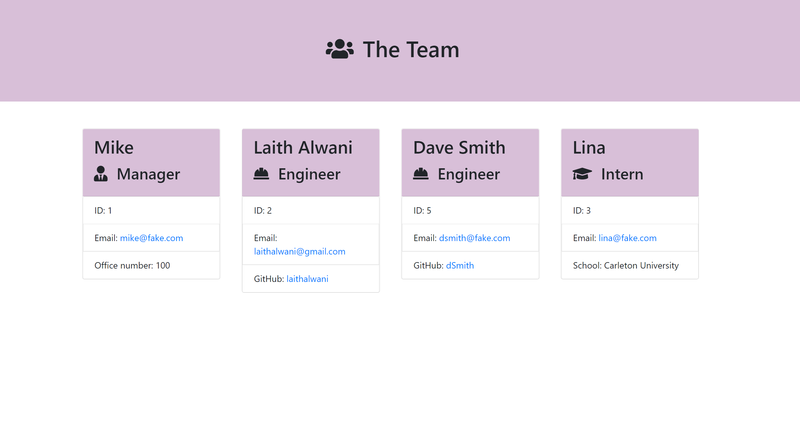
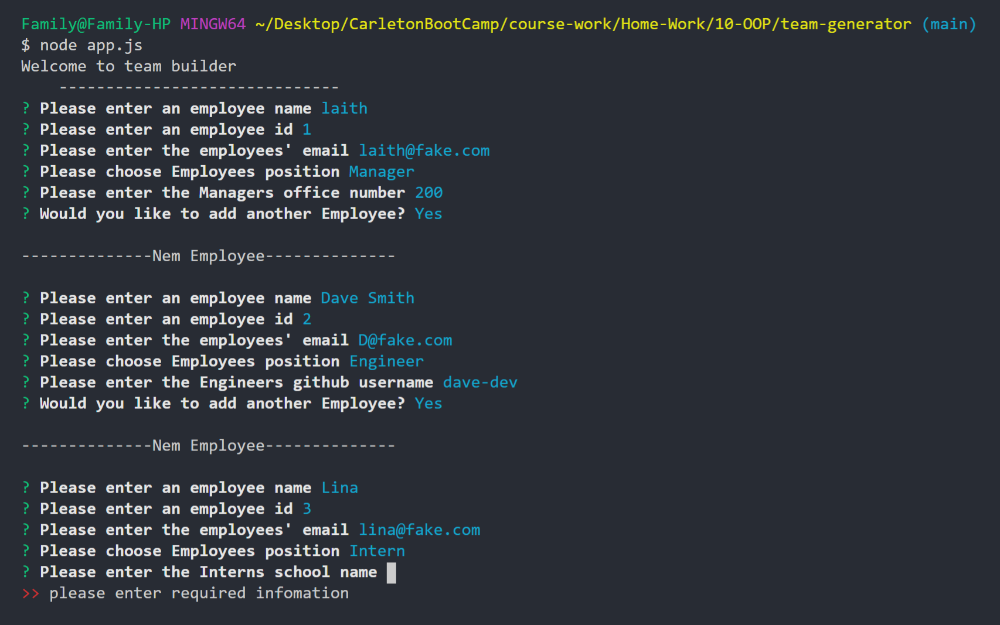

# Team Generator            

## Table of Content:
1.[Description](#Description)

2.[Installation Instructions](#Installation-Instructions)

3.[Usage Information](#Usage-Information)

4.[License](#License)

5.[Questions](#Questions)

6.[Demo](#Demo)

## Description:
Generate a webpage that displays a team's basic information.

## Installation Instructions:
* instal nodeJS lastest version
* run "npm i" to install the depencies used(jest and inquirer)

## Usage Information:
* run "node app.js" in the root folder to invoke the program 
* enter the employee name, id, email position and extra details about the employee
* a user can add as many members to thier team by answering yes to "add more emplyees?"
* answering "no" would terminate the program and generate the team.html file with the team's information

## License:
This application is covered under the     

## Questions:
for questions please contact at:
* Github: [laithalwani](https://github.com/laithalwani)
* laith@gmail.com

## Demo
